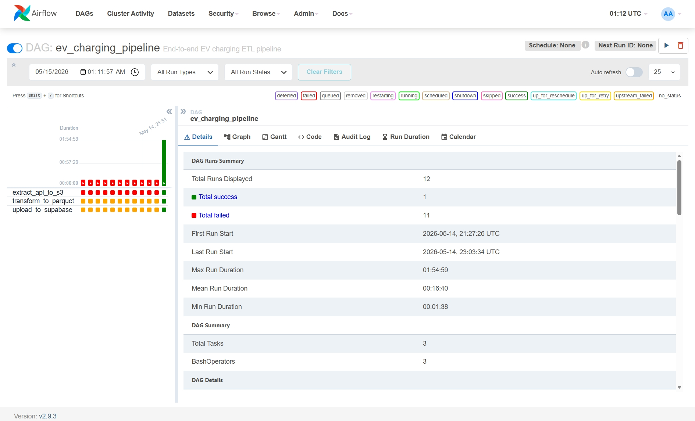
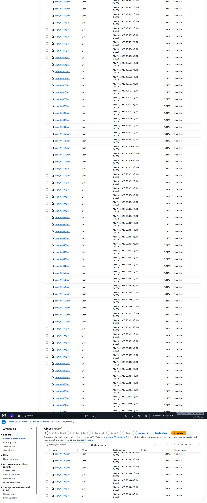
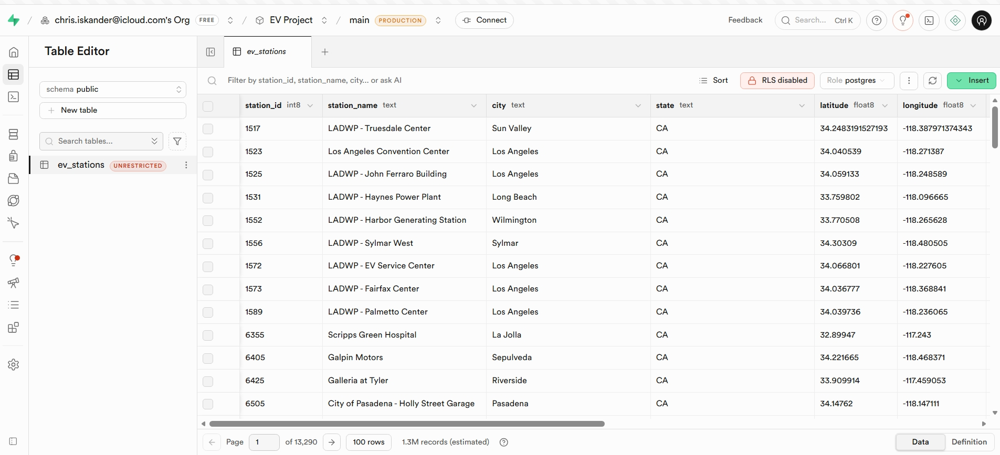
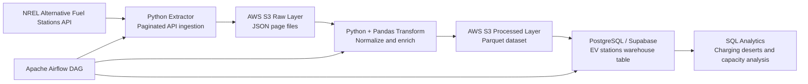

# EV Charging Infrastructure Pipeline


> A cloud-based data engineering pipeline that ingests EV charging station records from the National Renewable Energy Laboratory (NREL) API, lands raw paginated JSON in AWS S3, transforms the data into analytics-ready Parquet, loads it into PostgreSQL/Supabase, and supports SQL analysis of charging infrastructure coverage, fast-charging access, and potential charging deserts.

<p align="center">
  
</p>

---

## Project Highlights

- **Built an end-to-end batch ETL pipeline** for EV charging infrastructure data using Python, AWS S3, Pandas, Parquet, PostgreSQL/Supabase, Apache Airflow, and Docker Compose.
- **Implemented resume-safe API ingestion** by checking previously written S3 page files and continuing from the next missing page instead of restarting the full extraction.
- **Added fault-tolerant API behavior** with retry handling, exponential backoff for transient API failures, rate-limit handling, and request timeouts.
- **Designed a raw-to-processed data lake pattern** by storing paginated JSON responses in S3 and writing cleaned Parquet output to a processed S3 layer.
- **Created analytics-ready warehouse tables** in PostgreSQL/Supabase for SQL analysis of city-level charging capacity, DC fast-charging density, and station-level power scores.
- **Orchestrated the workflow with Apache Airflow** using a DAG that runs extract, transform, and load steps in sequence.
- **Documented reusable SQL analysis and data quality checks** in the `sql/` directory so the project includes both pipeline code and analytical outputs.

---

## Preview

### Airflow Orchestration



### AWS S3 Data Lake



### Supabase Warehouse



---

## What This Project Does

EV adoption depends not only on the number of charging stations, but also on whether those stations provide enough practical charging capacity. This project turns public EV charging station records into a warehouse-ready analytics dataset:

1. The extractor calls the NREL Alternative Fuel Stations API for electric charging station records.
2. Raw API pages are stored in AWS S3 as JSON files.
3. The transform step reads raw S3 data, normalizes station fields, fills missing charger counts, and calculates analytical features.
4. The processed dataset is written back to S3 as Parquet.
5. The load step reads the processed Parquet data and writes it into PostgreSQL/Supabase.
6. SQL files in `sql/` support analysis of charging density, infrastructure strength, and data quality.
7. Airflow orchestrates the pipeline as a repeatable DAG.

---

## Architecture



### Core Design Choices

| Layer | Technology | Purpose |
|---|---|---|
| Source | NREL Alternative Fuel Stations API | Public EV charging station data |
| Extraction | Python + Requests | Paginated API ingestion with backoff and timeout handling |
| Raw Data Lake | AWS S3 | Stores API pages as immutable raw JSON files |
| Transformation | Python + Pandas | Normalizes JSON into a tabular dataset |
| Processed Storage | Parquet on AWS S3 | Columnar analytics-ready output |
| Warehouse | PostgreSQL / Supabase | Queryable relational analytics layer |
| Orchestration | Apache Airflow | Runs extract, transform, and load tasks |
| Local Infra | Docker Compose | Runs the Airflow stack locally |
| Analysis | SQL | City, station, and charger-capacity insights |

---

## Repository Structure

```text
.
|-- dags/
|   `-- ev_file_airflow.py              # Airflow DAG definition
|-- scripts/
|   |-- extract_api_to_s3.py            # Extracts NREL API data into S3
|   |-- transform_to_parquet.py         # Transforms raw JSON into Parquet
|   `-- upload_to_supabase.py           # Loads processed data into Supabase/Postgres
|-- sql/
|   |-- 01_create_ev_stations_table.sql # Optional warehouse DDL and indexes
|   |-- 02_analytics_queries.sql        # Main SQL analysis queries
|   `-- 03_data_quality_checks.sql      # Post-load validation queries
|-- data/
|   |-- raw/
|   |   `-- raw_sample_data.json        # Sample raw API-style record
|   `-- processed/
|       `-- sample_cleaned_data.csv     # Sample cleaned output
|-- screenshots/
|   |-- Airflow_Screenshot.jpeg
|   |-- AWS_S3_Screenshot.jpeg
|   `-- Supabase_Screenshot.jpeg
|-- architecture_diagram/
|   `-- Architecture Diagram 1.png
|-- docker-compose.yaml                 # Local Airflow environment
|-- requirements.txt                    # Python dependencies
|-- .env.example                        # Safe sample environment file
`-- README.md
```

---

## Tech Stack

- **Python** for extraction, transformation, S3 interaction, and warehouse loading
- **Requests** for NREL API calls
- **Boto3** for AWS S3 reads and writes
- **Pandas** for JSON normalization and feature engineering
- **PyArrow / Parquet** for columnar processed output
- **AWS S3** for raw and processed cloud data lake storage
- **PostgreSQL / Supabase** for the analytics warehouse
- **SQLAlchemy + psycopg2** for database loading
- **Apache Airflow** for workflow orchestration
- **Docker Compose** for local Airflow services
- **SQL** for infrastructure analysis and validation checks

---

## Prerequisites

Before running the full pipeline, install or prepare:

- Python 3.10+
- Docker Desktop
- An NREL API key
- An AWS account and S3 bucket
- AWS credentials with permission to list, read, and write objects in the target bucket
- A PostgreSQL database or Supabase project
- A local `.env` file created from `.env.example`

---

## Quick Start

### 1. Clone the Repository

```bash
git clone https://github.com/ciskander2/EV_Charging_Infrastructure_Pipeline.git
cd EV_Charging_Infrastructure_Pipeline
```

### 2. Create a Virtual Environment

```bash
python -m venv .venv
source .venv/bin/activate
```

On Windows PowerShell:

```powershell
python -m venv .venv
.\.venv\Scripts\Activate.ps1
```

### 3. Install Dependencies

```bash
pip install -r requirements.txt
```

### 4. Create Your Environment File

```bash
cp .env.example .env
```

Then replace the fake values in `.env` with your real credentials and project settings.

### 5. Start Airflow

Initialize Airflow:

```bash
docker compose up airflow-init
```

Start the Airflow services:

```bash
docker compose up
```

Open the Airflow UI:

```text
http://localhost:8080
```

Default local Airflow credentials:

```text
username: airflow
password: airflow
```

Trigger the DAG:

```text
ev_charging_pipeline
```

---

## Environment Variables

Create a `.env` file in the project root. Use `.env.example` as the safe template.

```env
NREL_API_KEY=DEMO_KEY_OR_YOUR_NREL_API_KEY

S3_BUCKET=your-ev-charging-s3-bucket
AWS_ACCESS_KEY_ID=your_aws_access_key_id
AWS_SECRET_ACCESS_KEY=your_aws_secret_access_key
AWS_DEFAULT_REGION=us-east-1

RAW_PREFIX=raw/ev_stations
PROCESSED_KEY=processed/clean_ev_stations.parquet

SUPABASE_USER=postgres.your_project_ref
SUPABASE_PASSWORD=your_supabase_database_password
SUPABASE_HOST=aws-1-us-east-2.pooler.supabase.com
SUPABASE_PORT=5432
SUPABASE_DATABASE=postgres
SUPABASE_TABLE=ev_stations
```

### Secret Values

Keep these values only in your local `.env` file:

- `NREL_API_KEY`
- `AWS_ACCESS_KEY_ID`
- `AWS_SECRET_ACCESS_KEY`
- `SUPABASE_PASSWORD`

### Project-Specific Values

These are not always secret, but they are specific to your setup:

- `S3_BUCKET`
- `AWS_DEFAULT_REGION`
- `SUPABASE_USER`
- `SUPABASE_HOST`
- `SUPABASE_DATABASE`
- `SUPABASE_TABLE`

### Notes

- `.env` is ignored by git.
- `.env.example` is safe to commit because it contains fake placeholder values.
- `RAW_PREFIX` controls where raw JSON pages are written in S3.
- `PROCESSED_KEY` controls where the cleaned Parquet output is written in S3.
- `SUPABASE_TABLE` defaults to `ev_stations`.

---

## Run the Pipeline

### Option 1: Run with Airflow

The Airflow DAG is defined in `dags/ev_file_airflow.py`.

Task order:

```text
extract_api_to_s3 -> transform_to_parquet -> upload_to_supabase
```

Start Airflow with Docker Compose and trigger `ev_charging_pipeline` from the Airflow UI.

### Option 2: Run Scripts Manually

After creating `.env` and installing dependencies, you can run each step directly.

Extract raw API pages into S3:

```bash
python scripts/extract_api_to_s3.py
```

Transform raw S3 JSON into processed Parquet:

```bash
python scripts/transform_to_parquet.py
```

Load processed Parquet into Supabase/PostgreSQL:

```bash
python scripts/upload_to_supabase.py
```

Manual runs are useful for debugging individual steps before running the full Airflow DAG.

---

## Extraction Details

`scripts/extract_api_to_s3.py` calls the NREL API with:

- `fuel_type=ELEC`
- configurable page limit through `NREL_PAGE_LIMIT`
- configurable request timeout through `NREL_REQUEST_TIMEOUT_SECONDS`
- exponential backoff for transient API errors

Raw S3 object pattern:

```text
s3://<S3_BUCKET>/<RAW_PREFIX>/page_00000.json
s3://<S3_BUCKET>/<RAW_PREFIX>/page_00001.json
s3://<S3_BUCKET>/<RAW_PREFIX>/page_00002.json
```

Resume behavior:

- The extractor lists existing S3 objects under `RAW_PREFIX`.
- It finds the highest `page_XXXXX.json` file already written.
- It resumes from the next page number.
- This prevents unnecessary re-extraction after interruptions.

---

## Transformation Details

`scripts/transform_to_parquet.py` reads all raw JSON page files from S3 and normalizes them into a tabular dataset.

Selected output fields:

| Column | Description |
|---|---|
| `station_id` | NREL station identifier |
| `station_name` | Charging station name |
| `city` | Station city |
| `state` | Station state |
| `latitude` | Latitude coordinate |
| `longitude` | Longitude coordinate |
| `network` | EV charging network/provider |
| `level2_ports` | Number of Level 2 charging ports |
| `dc_fast_ports` | Number of DC fast-charging ports |
| `access` | Public/private access code |
| `status` | NREL station status code |
| `station_count` | Row-level count used for aggregation |
| `infrastructure_score` | Weighted charging capacity score |
| `fast_charging_density` | DC fast ports per station row |

### Infrastructure Score

The infrastructure score weights DC fast charging more heavily than Level 2 charging:

```text
infrastructure_score = level2_ports + (dc_fast_ports * 20)
```

This helps distinguish cities with many slower chargers from cities with stronger fast-charging capacity.

### Processed Output

Processed Parquet output:

```text
s3://<S3_BUCKET>/<PROCESSED_KEY>
```

Default:

```text
s3://<S3_BUCKET>/processed/clean_ev_stations.parquet
```

---

## PostgreSQL / Supabase Warehouse

The loader reads the processed Parquet file and writes it to PostgreSQL/Supabase.

Default table:

```text
public.ev_stations
```

The expected table schema is documented in:

```text
sql/01_create_ev_stations_table.sql
```

The loader currently uses `if_exists="replace"`, which means each successful load replaces the existing `ev_stations` table with the latest processed dataset. For production, this could be changed to an incremental load or merge strategy.

---

## SQL Analytics

The main SQL analysis file is:

```text
sql/02_analytics_queries.sql
```

It includes four analysis queries:

| Query | Purpose |
|---|---|
| Query 1 | Calculates city-level estimated charging capacity score |
| Query 2 | Finds cities with at least 6 stations and ranks them by lowest DC fast-port density |
| Query 3 | Ranks cities by total DC fast-charging ports |
| Query 4 | Ranks individual stations by estimated charging capacity score |

### Example: DC Fast-Port Density

```sql
select
    city,
    state,
    count(*) as station_name_count,
    sum(coalesce(dc_fast_ports, 0)) as dc_fast_ports_count,
    sum(coalesce(dc_fast_ports, 0))::numeric / nullif(count(*), 0) as dc_charging_port_density
from public.ev_stations
group by city, state
having count(station_name) >= 6
order by dc_charging_port_density asc, city desc;
```

This query helps identify cities that have multiple charging stations but relatively weak DC fast-charging access.

---

## Data Quality Checks

Post-load validation queries live in:

```text
sql/03_data_quality_checks.sql
```

Included checks:

- Total row count
- Duplicate station IDs
- Missing city/state/coordinate values
- Negative charger counts
- Stations with zero recorded charger ports

These checks are useful after the Airflow DAG finishes and before presenting the SQL analysis.

---

## Reliability Features

This project includes several practical data engineering reliability patterns:

- Resume-safe extraction based on S3 page files
- API retry handling for `429`, `502`, `503`, and `504` responses
- Exponential backoff for transient failures
- Explicit request timeouts
- Environment-based configuration instead of hardcoded secrets
- Airflow task orchestration for repeatable execution
- Raw S3 storage for replay and auditability
- Processed Parquet output for efficient analytical reads
- SQL data quality checks after warehouse load

---

## Analytics Use Cases

This pipeline can answer infrastructure questions such as:

- Which cities have the strongest overall EV charging capacity?
- Which cities have many stations but limited DC fast charging?
- Which individual stations have the highest estimated charging capacity?
- How concentrated is fast-charging infrastructure by city and state?
- Where might charging deserts or long-distance EV adoption bottlenecks exist?
- How different is infrastructure quantity from infrastructure usability?

---

## Testing and Validation

This repository includes a GitHub Actions CI workflow at:

```text
.github/workflows/ci.yml
```

The workflow runs automatically on pushes and pull requests to `main`. It validates:

- Python syntax for files in `dags/` and `scripts/`
- Docker Compose configuration
- Required SQL files in `sql/`
- The presence of `.env.example`

You can also run the same style of checks locally:

```bash
# Validate Python syntax
python -m compileall dags scripts
```

```bash
# Validate Docker Compose syntax
docker compose config --quiet
```

```bash
# Confirm Airflow services are running
docker compose ps
```

After loading data into Supabase/PostgreSQL, run:

```text
sql/03_data_quality_checks.sql
```

Suggested future tests:

- Unit tests for NREL API response parsing
- Unit tests for station normalization
- Unit tests for infrastructure score calculation
- Integration test for S3 raw-to-processed transformation
- Airflow DAG import validation
- SQL checks for accepted value ranges and null thresholds

---

## Troubleshooting

### Missing `NREL_API_KEY`

Create a `.env` file from `.env.example` and add your NREL API key.

### Missing `S3_BUCKET`

Set `S3_BUCKET` in `.env` to the bucket where raw and processed data should be stored.

### AWS Credentials Not Found

Make sure these are set in `.env`:

```text
AWS_ACCESS_KEY_ID
AWS_SECRET_ACCESS_KEY
AWS_DEFAULT_REGION
```

If you prefer using your local AWS profile, make sure Docker can mount your AWS credentials directory.

### Supabase Connection Fails

Verify:

- `SUPABASE_USER`
- `SUPABASE_PASSWORD`
- `SUPABASE_HOST`
- `SUPABASE_PORT`
- `SUPABASE_DATABASE`

For Supabase pooler connections, the username often looks like:

```text
postgres.<project_ref>
```

### Airflow Task Fails During Import

Check that the `scripts/` folder is mounted into the Airflow container and that dependencies are available through `_PIP_ADDITIONAL_REQUIREMENTS` in `docker-compose.yaml`.

---

## Future Improvements

- Add automated unit tests and integration tests
- Add dbt models for repeatable warehouse transformations
- Add Great Expectations or Soda checks for data quality
- Add incremental warehouse loading instead of full table replacement
- Add partitioned Parquet output by state or ingestion date
- Add a Streamlit or Power BI dashboard for interactive exploration
- Build a custom Airflow image instead of installing dependencies at container startup
- Add monitoring and alerting for failed DAG runs
- Add cost and runtime metrics for each pipeline stage

---

## Author

Built by [ciskander2](https://github.com/ciskander2) as an end-to-end data engineering project demonstrating cloud data lake storage, ETL orchestration, warehouse loading, and SQL-based infrastructure analysis.

---

## Portfolio Summary

**Python, Apache Airflow, Docker, AWS S3, PostgreSQL, Supabase, Pandas, Parquet, SQL, ETL**

Designed and implemented a cloud-based EV charging infrastructure ETL pipeline that ingests paginated NREL API records, stores raw JSON data in AWS S3, transforms nested station data into analytics-ready Parquet with Pandas, and loads processed datasets into PostgreSQL/Supabase for SQL analysis. Built resume-safe extraction with S3 checkpointing, retry and backoff handling, Airflow orchestration, environment-based configuration, warehouse DDL, analytical SQL queries, and data quality checks to identify charging infrastructure gaps, DC fast-charging density, and potential EV adoption bottlenecks.
